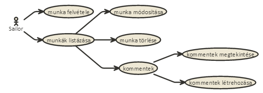
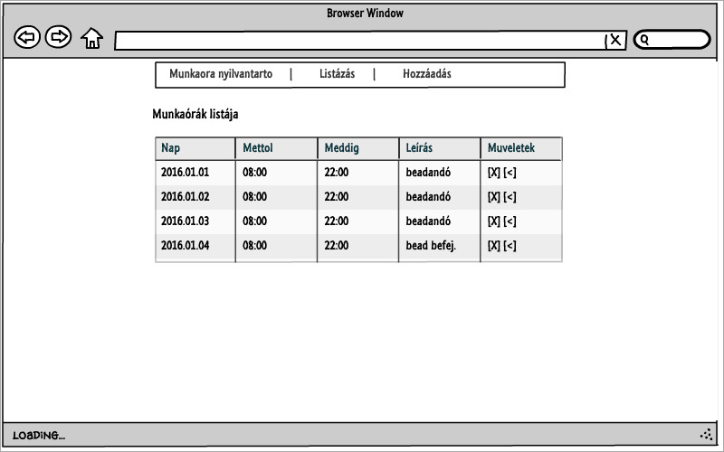
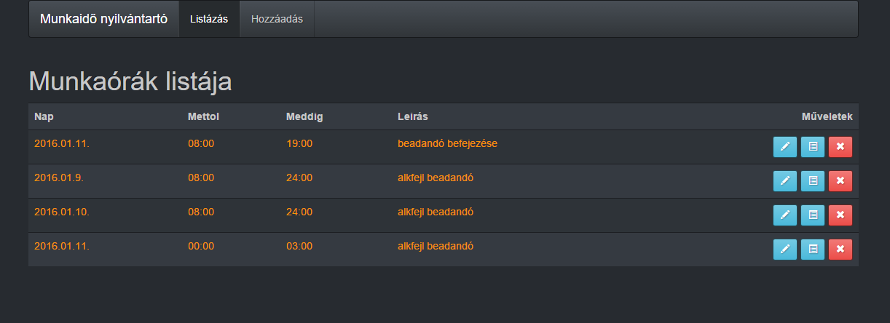

# Alkalmazások fejlesztése dokumentáció

## Követelményanalízis
1. Követelmények összegyűjtése
	1. Funkcionális elvárások:
		* A felhasználok tudják feljegyezni hogy melyik napon mettől meddig dolgoztak.
		* Legyen lehetőségük módosítani az esetleges változásokat.
		* Tudják törölni a munkaóráikat.
		* Az adminisztrátoroknak legyen lehetőségük jováhagyni a felhasználók által ledolgozott órákat.
		* A főoldalon az alkalmazás rövid ismertetése található
		* A felhasználók a jogosultsági szintüktől függően csak adott gombokat láthatnak.
	2. Nem funkcionális elvárások:
		* Felhasználóbarát, ergonomikus elrendezés és kinézet.
		* Gyors működés.
		* Biztonságos működés: jelszavak kódolt tárolása, funkciókhoz való hozzáférés.
2. Használati modell
	1. Szerepkörök
		* felhasználók (munkaórák rögzítése/listázása/módosítása/törlése)
		* adminisztátorok (munkaórák jóváhagyása)
	2. Használati diagramm
	
	

	3. Folyamatok pontos menete:
		- komment rögzítése:
			- munkaórák listázása
			- kommentek megjelenítése gomb-re kattintva feljönnek a kommentek
			- a szövegmezőbe a komment beírása
			- mentés gombal a komment elmentése
		
		

## Tervezés
1. Architektúra terv
	1. Oldaltérkép
		* Felhasználó
			* Főoldal
			* Munkaórák listázása
				* Munkaóra módosítása
				* Munkaóra törlése
				* Kommentek listázása
				    * Új komment létrehozása
			* Munkaóra létrehozása
			* 
	2. Végpontok
		* GET /munkaora.new: munkaóra rögzítés oldal
		* POST /munkaora.new: munkaóra adatok felküldése
		* GET /munkaora: munkaórák listázása oldal
		* GET /munkaora/:id : munkaóra módosítása oldal
		* POST /munkaora/:id : munkaóra módosított adatainak felküldése
		* GET /comment/:id : munkaóra kommentjeinek oldal

2. Felhasználóifelület-modell
	1. Oldalvázlat

		

	2. Designterv
	
		

3. Osztálymodell
	1. Adatmodell

		Munkaora 1 ───> * Komment
		-nap              -komment szovege  
		-mettol
		-meddig
		-leiras


## Implementáció
1. Fejlesztői környezet bemutatása
	Az alkalmazást egy online c9 nevű IDE-ben lett implementálva a Node.js alapokkal és egyéb modulok használatával.
2. Könyvtárstruktúrában lévő mappák funkiójának bemutatása
```
...
─app                        ROOT
 ├───pods                   adatmodellek
 │   ├───application        JSONAPI adapter tulajdonságok
 │   ├───comment            komment modell és megjelenés
 │   ├───components         oldalon megjelenő komponensek
 │   |   ├───comment-form   komment rögzítés komponense
 │   |   ├───munka-details  munkaóra megjelenítés komponense
 │   |   ├───munkaora-edit  munkaóra szerkesztés komponense
 │   |   └───munkaora-form  munkaóra rögzítés komponense
 │   ├───index              főoldal megjelenése
 │   ├───munkaora           munkaórák listázása
 │   |   ├───edit           munkaóra szerkesztése
 │   |   └───new            munkaóra rögzítése
 │   └───worktime           munkaóra modell
 └───styles                 stíluslapok
```
	
## Tesztelés
1. Tesztelés bemutatása
	Az egység teszteket a mocha valamint chai modulok segítségével, míg a funkcionális felületoi teszteket Selenium IDE segítségével valósítjuk meg.
2. Egszégtesztek
	Az egység tesztek lényege hogy az adatmodelleket valamint a belső megvalósítások helyességét ellenőrizzük.
	A tesztek 'npm test' parancsal indíthatóak és a User adatmodell tesztelését valósítja meg a test/create.test.js
3. Funkcionális felületi tesztek
	A teszteléshez szükséges fájlok a test/selenium/ mappában találhatóak.
4. Tesztesetek végigpróbálása
	- egységtesztek: velhasználók létrehozásának helyes és helytelen lehetőségeit.
	- funkcionális: bejelentkezés majd új bejegyzés létrehozása és módosítását.

## Felhasználói dokumentáció
1. A futtatáshoz szükséges hardver legalább egy Pentium I-es processzorral ellátott linux operációsrendszert futtató számítógép 'npm' csomaggal és interneteléréssel
2. Futtatás
	- githubról az egész projektet le kell klónozni a helyi könyvtárba ```git clone``` parancsal
	- az npm install parancso kiadva letöltődnek az alkalmazáshoz tartozó függőségek.
	- az alkalmazás az nodemon index parancsal indul
2. az alkalmazás értelemszerűen használható
	- regisztráció
	- bejelentkezés
	- munkaórák rögzítése
	- munkaórák módosítása (ha szükséges)
	- adminisztrátoroknak: (ha helyes a rögzített óra akkor jóváhagja)